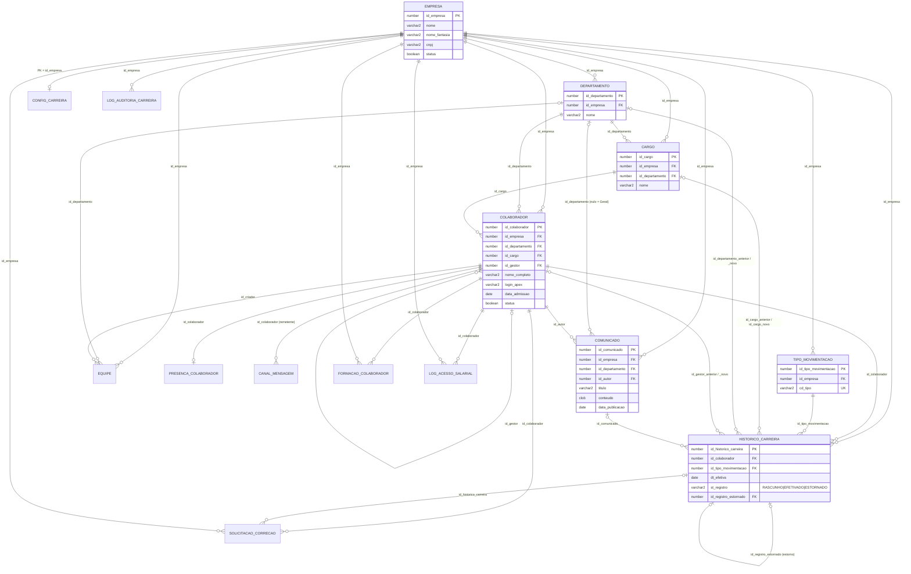

# 05 · Banco de dados (modelo de dados reconstruído)

> Documento para IAs/devs futuros. Reconstruído **a partir do código** do repositório (sem acesso ao banco).
> Schema: `WKSP_CORLIXHUB` · Oracle Database **23ai** (usa `BOOLEAN`, `CREATE ... IF NOT EXISTS`, `MERGE ... USING (VALUES ...)`) · APEX **26.1.5** (app 100).
>
> Legenda de confiabilidade:
> - **[DDL]** = definido em script versionado no repo (fonte de verdade).
> - **[INFERIDO DO USO]** = tabela/coluna sem DDL no repo; deduzida de queries, formulários APEX, `%type`, INSERTs de teste e de `00_verificar_schema.sql`. Tipos/tamanhos são prováveis, não garantidos.

---

## 1. Visão geral

### 1.1 Onde está cada coisa

| Caminho | Conteúdo |
|---|---|
| `modulos/historico-carreira/` | Único DDL versionado: módulo Histórico de Carreira (tabelas, views, packages, triggers, seed, carga, testes). Instalador: `instalar.sql`. |
| `modulos/organograma/organograma.sql` | View `VW_ORG_COLABORADOR` + package `PKG_ORGANOGRAMA` (sem tabelas). |
| `scripts/apex-limpar-sql-scripts.sql` | Bloco PL/SQL utilitário que apaga SQL Scripts do workspace (`APEX_APPLICATION_FILES`). Não cria objetos. |
| `database/f100.sql` | Export SQL da app APEX 100 (12 MB). **Não contém DDL de tabelas**; o "Supporting Objects" (`create_install`) está vazio. Use só com `grep`. |
| `corlixhub/pages/*.apx`, `corlixhub/shared-components/*.apx` | App em APEXlang; fonte das queries usadas para inferir as tabelas base. |

**Confirmado:** `database/ddl/schema_corlixhub.sql` e `database/seed/seed_corlixhub.sql`, citados no `README.md` (seções "Modelo de dados" e "Migrations e seeds"), **NÃO existem** no repo (`database/` só tem `f100.sql`). O README também cita uma entidade `Movimentacao_Carreira`, que na prática é `HISTORICO_CARREIRA`. Não há ferramenta de migration (Flyway/Liquibase).

### 1.2 Grupos de objetos

| Grupo | Objetos | Origem |
|---|---|---|
| Núcleo (multi-tenant) | `EMPRESA`, `DEPARTAMENTO`, `CARGO`, `COLABORADOR` | [INFERIDO DO USO] |
| Comunicação | `COMUNICADO`, `CANAL_MENSAGEM`, `PRESENCA_COLABORADOR`, função `CH_GET_CANAL_DIRETO` | [INFERIDO DO USO] |
| Equipes | `EQUIPE` | [INFERIDO DO USO] |
| Logs da app | `APP_LOG`, package `LOG_PKG` | [INFERIDO DO USO] |
| Histórico de Carreira | `CONFIG_CARREIRA`, `TIPO_MOVIMENTACAO`, `HISTORICO_CARREIRA`, `FORMACAO_COLABORADOR`, `SOLICITACAO_CORRECAO`, `LOG_ACESSO_SALARIAL`, `LOG_AUDITORIA_CARREIRA`, 4 views, 7 triggers, `PRC_SEED_TIPO_MOVIMENTACAO`, `FN_CARREIRA_VE_SALARIO`, `PKG_HISTORICO_CARREIRA`, `PKG_HISTORICO_CARREIRA_UI` | [DDL] |
| Organograma | `VW_ORG_COLABORADOR`, `PKG_ORGANOGRAMA` | [DDL] |

### 1.3 Convenções de nomes

- Tabelas antigas (núcleo): sem prefixo, colunas por extenso (`NOME`, `DATA_ADMISSAO`, `STATUS`, `ID_<TABELA>`).
- Tabelas do módulo de carreira: colunas com prefixo de tipo — `ID_` (chave), `DT_` (data), `DS_` (descrição), `VL_` (valor), `ST_` (status/estado), `FL_` (flag `BOOLEAN`), `NR_` (número), `QT_` (quantidade), `TP_`/`CD_` (código/tipo), `NM_` (nome, em views), `BL_` (BLOB), `USR_` (usuário).
- Colunas de auditoria padrão do módulo: `DT_CRIACAO`, `USR_CRIACAO`, `DT_ALTERACAO`, `USR_ALTERACAO` (`TIMESTAMP WITH TIME ZONE` / `VARCHAR2(255)`), preenchidas por trigger. Usuário = `coalesce(sys_context('APEX$SESSION','APP_USER'), sys_context('USERENV','SESSION_USER'))`.
- Flags são `BOOLEAN` nativo (`true`/`false`), inclusive `COLABORADOR.STATUS`. Nas queries: `where status = true`.
- Multi-tenant por coluna `ID_EMPRESA` (sem VPD). Todas as tabelas novas a têm.

### 1.4 Ordem de instalação (`modulos/historico-carreira/instalar.sql`)

Rodar no SQLcl como dono do schema: `cd modulos/historico-carreira && sql <usuario>@<servico> @instalar.sql`. Usa `whenever sqlerror exit failure rollback`, `set define off`.

| Passo | Arquivo | Faz |
|---|---|---|
| 00 | `00_verificar_schema.sql` | Exige `dbms_db_version.version >= 23` (-20000) e confere 27 `TABELA.COLUNA` do núcleo em `USER_TAB_COLUMNS`; aborta (-20000) listando o que falta. Não cria nada. Lista tipos reais das 5 tabelas base. |
| 01 | `01_ddl_historico_carreira.sql` | 7 tabelas, constraints, índices, comentários (reexecutável). |
| 02 | `02_seed_tipo_movimentacao.sql` | Cria `PRC_SEED_TIPO_MOVIMENTACAO` e aplica em todas as empresas (commit). |
| 03 | `03_views_carreira.sql` | `FN_CARREIRA_VE_SALARIO` + 4 views. |
| 04 | `04_pkg_historico_carreira.pks/.pkb` | Package de regras de negócio. |
| 04b | `08_pkg_historico_carreira_ui.sql` | Package de renderização da página 13. |
| 05 | `05_triggers_auditoria.sql` | 7 triggers. |
| 06 | `06_carga_inicial.sql` | Gera `ADMISSAO` efetivada para colaboradores sem histórico (commit). |
| 07 | `07_testes.sql` | Testes; terminam em `ROLLBACK`. |
| — | consulta final | Lista objetos `INVALID` do módulo (deve vir vazia). |

Organograma: rodar `modulos/organograma/organograma.sql` à parte (depende só de `COLABORADOR`, `CARGO`, `DEPARTAMENTO`).

Pré-requisito: as tabelas do núcleo + `COMUNICADO` já precisam existir (FKs do módulo apontam para elas). Como o DDL delas não está no repo, uma instalação do zero é **impossível só com o repositório**.

---

## 2. Diagrama ER



FKs das tabelas do núcleo/comunicação são **inferidas** (pelas junções usadas); as do módulo de carreira são declaradas no DDL. `CANAL_MENSAGEM.ID_CANAL` aponta para uma tabela de canais não identificada (ver Lacunas). `LOG_AUDITORIA_CARREIRA` referencia só `EMPRESA` (FK); `ID_REGISTRO` é polimórfico (PK da tabela em `NM_TABELA`).

---

## 3. Tabelas do núcleo [INFERIDO DO USO]

Fontes: `00_verificar_schema.sql` (lista as colunas que o módulo de carreira exige), `07_testes.sql` (INSERTs de fábrica), formulários APEX (`dataType`, `maxLength`, `valueRequired`), LOVs, queries das páginas, `%type` nos packages.

### 3.1 `EMPRESA`

Tenant. PK provavelmente identity (o teste insere sem PK e usa `returning id_empresa`).

| Coluna | Tipo provável | Nulo? | Observado em |
|---|---|---|---|
| `ID_EMPRESA` | NUMBER (PK, identity/default) | não | 00, P15, P16 (primaryKey), todas as FKs |
| `NOME` | VARCHAR2 (form max 200) | obrigatório no form | 00, P16, P15, LOV `EMPRESA.NOME`, proc. `G_NOME_EMPRESA` |
| `NOME_FANTASIA` | VARCHAR2 (form max 255) | obrigatório no form | 00, P16, `pkg_historico_carreira_ui.render` (`coalesce(nome_fantasia, nome)`) |
| `CNPJ` | VARCHAR2 (max 20) | obrigatório no form | P16, testes |
| `STATUS` | BOOLEAN | obrigatório no form | P16, P15 (LOV BOOLEAN), testes (`true`) |
| `DATA_CRIACAO` | DATE | obrigatório no form | P16, P15, testes (`sysdate`) |
| `EMAIL_CORPORATIVO` | VARCHAR2 (max 255) | obrigatório no form | P16 |
| `TELEFONE` | VARCHAR2 (max 12) | obrigatório no form | P16 |
| `CEP` | VARCHAR2 (max 8) | obrigatório no form | P16 (DA "endereço por CEP") |
| `LOGRADOURO` | VARCHAR2 (max 100) | obrigatório | P16 |
| `NUMERO` | VARCHAR2 (max 4) | obrigatório | P16 |
| `COMPLEMENTO` | VARCHAR2 (max 30) | opcional | P16 |
| `BAIRRO` | VARCHAR2 (max 50) | obrigatório | P16 |
| `CIDADE` | VARCHAR2 (max 100) | obrigatório | P16 |
| `UF` | VARCHAR2 (max 2) | obrigatório | P16 |
| `LOGOTIPO_EMPRESA` | BLOB | opcional | P16 |

Leitura/escrita: P15 "Empresas cadastradas" (IR sobre a tabela), P16 "Cadastro de empresas" (form DML automático), P14 (LOV), proc. de app `G_NOME_EMPRESA`, LOV `EMPRESA.NOME` (usada em P26/P27), `prc_seed_tipo_movimentacao` (loop), `06_carga_inicial`, `pkg_historico_carreira_ui.render`.
Obs.: "Obrigatório no form" ≠ `NOT NULL` no banco; não há como confirmar.

### 3.2 `DEPARTAMENTO`

| Coluna | Tipo provável | Observado em |
|---|---|---|
| `ID_DEPARTAMENTO` | NUMBER PK (identity) | 00, testes, várias junções |
| `ID_EMPRESA` | NUMBER FK→EMPRESA | 00, P14/P17 LOV (`where id_empresa = ...`), pkg (validação de tenant) |
| `NOME` | VARCHAR2 | 00, views, LOV `DEPARTAMENTO.NOME` |

Leitura: P1 (comunicados, `nvl(d.nome,'Geral')`), P4 (chat, agrupa contatos), P14 (LOV cascata por empresa), P17 (LOV por empresa do usuário), P26/P27 (LOV), `VW_ORG_COLABORADOR`, views de carreira, packages. Escrita: nenhuma página do repo (só `07_testes`).
Mencionado em `Etapas-organograma.md`: tabela `DEPARTAMENTO_METRICA` e coluna `ID_LIDER` de uma versão anterior ("pode mantê-las") — existência não confirmada.

### 3.3 `CARGO`

| Coluna | Tipo provável | Observado em |
|---|---|---|
| `ID_CARGO` | NUMBER PK (identity) | 00, testes |
| `ID_EMPRESA` | NUMBER FK→EMPRESA | 00, P14 LOV, pkg |
| `ID_DEPARTAMENTO` | NUMBER FK→DEPARTAMENTO (anulável? o pkg trata `null`) | 00, P14 LOV cascata, pkg (regra cargo∈departamento, -20014) |
| `NOME` | VARCHAR2 | 00, views, proc. `APP_USER_CARGO` |

Regra implícita: o LOV de gestor em P14 considera gestor quem tem `CARGO.NOME = 'Gestor'` (hard-coded).
Leitura: P1, P4, P14, proc. `APP_USER_CARGO`, views, packages. Escrita: nenhuma página (só testes).

### 3.4 `COLABORADOR` (tabela central)

| Coluna | Tipo provável | Nulo? | Observado em |
|---|---|---|---|
| `ID_COLABORADOR` | NUMBER PK (identity) | não | 00, P14 (primaryKey) |
| `ID_EMPRESA` | NUMBER FK→EMPRESA | obrigatório (form) | 00, P14, P17 (default do item) |
| `ID_DEPARTAMENTO` | NUMBER FK→DEPARTAMENTO | obrigatório (form) | 00, P14 |
| `ID_CARGO` | NUMBER FK→CARGO | obrigatório (form) | 00, P14 |
| `ID_GESTOR` | NUMBER FK→COLABORADOR (auto-relacionamento; nulo = topo) | sim | 00, P14, P1, organograma |
| `NOME_COMPLETO` | VARCHAR2 (form max 200) | obrigatório | 00, P14, LOV `COLABORADOR.NOME_COMPLETO` |
| `PRIMEIRO_NOME` | VARCHAR2 (max 30) | opcional | P14, P1, P4, testes |
| `ULTIMO_NOME` | VARCHAR2 (max 30) | opcional | P14, P1, P4, testes |
| `EMAIL` | VARCHAR2 (max 200) | obrigatório (form) | P14, `VW_ORG_COLABORADOR`, testes |
| `LOGIN_APEX` | VARCHAR2 (max 255) | opcional | 00, P14; **chave de ligação com `:APP_USER`** (sempre comparada com `upper(trim())`) |
| `DATA_ADMISSAO` | DATE | sim | 00, P14, pkg carreira (atualiza na readmissão) |
| `DATA_DE_NASCIMENTO` | DATE | sim | P14, P1 (aniversariantes do mês), organograma (só dia/mês) |
| `STATUS` | BOOLEAN (`true` = ativo; nulo/false = inativo) | — | 00, P14 (switch), P4, organograma, pkg carreira (desligamento → false) |
| `FOTO_URL` | VARCHAR2 (nome de arquivo em `#APP_FILES#...`) | sim | 00, P1, P4, procs. `APP_USER_FOTO`, organograma |
| `IMAGEM_PERFIL` | BLOB | sim | `VW_ORG_COLABORADOR` (`tem_imagem`); servido pelo processo `DOWNLOAD_FOTO` (fora do repo) |

Índice/unique recomendado mas não confirmado: `upper(login_apex)` — o código trata `TOO_MANY_ROWS`, sinal de que não há unique garantido.
Inconsistência de caminho de foto: P1 usa `#APP_FILES#Fotos Colaboradores/<FOTO_URL>`, `APP_USER_FOTO` e P1 (gestor) usam `#APP_FILES#fotos/<FOTO_URL>`, organograma usa `FOTO_URL` como URL completa.

Quem lê: praticamente tudo (procs. de app `APP_USER_CARGO`, `APP_USER_FOTO`, `G_NOME_EMPRESA`; P1, P4, P14, P17; LOVs; views; packages).
Quem escreve: P14 (form DML automático, insert) + processo `APEX_UTIL.CREATE_USER` (cria a conta APEX com `P14_LOGIN`); `PKG_HISTORICO_CARREIRA.efetivar_movimentacao` / `estornar_movimentacao` (`UPDATE` de `ID_CARGO`, `ID_DEPARTAMENTO`, `ID_GESTOR`, `STATUS`, `DATA_ADMISSAO`).

### 3.5 `COMUNICADO`

| Coluna | Tipo provável | Observado em |
|---|---|---|
| `ID_COMUNICADO` | NUMBER PK (identity; `returning` no pkg) | 00, P17 (primaryKey), P1 |
| `ID_EMPRESA` | NUMBER FK→EMPRESA | 00, P17 (default = empresa do usuário) |
| `ID_DEPARTAMENTO` | NUMBER FK→DEPARTAMENTO, **anulável** (nulo = "Geral") | 00, P17, P1 |
| `ID_AUTOR` | NUMBER FK→COLABORADOR | 00, P17 (default = colaborador do `APP_USER`) |
| `TITULO` | VARCHAR2 — form valida max **200**; o pkg trunca em **100** (`c_max_titulo_comunicado`, "confira o tamanho real") | 00, P17, P1 |
| `CONTEUDO` | CLOB | 00, P17, P1 (`dbms_lob.substr(...,250,1)`) |
| `DATA_PUBLICACAO` | DATE (default do item = `SYSDATE`) | 00, P17, P1 |
| `IMAGEM` | BLOB (capa) | P17 (upload), P1 |
| `MIME_TYPE` | VARCHAR2 | P17 (`mimeTypeColumn`), P1 |
| `NOME_ARQUIVO` | VARCHAR2 | P17 (`filenameColumn`), P1 |

Leitura: P1 (3 mais recentes, **sem filtro de empresa**). Escrita: P17 (form DML), `PKG_HISTORICO_CARREIRA.publicar_comunicado` (privada; INSERT na efetivação). Referenciada por `HISTORICO_CARREIRA.ID_COMUNICADO`.

---

## 4. Outras tabelas sem DDL [INFERIDO DO USO]

### 4.1 `EQUIPE` (P26 "Central de equipes" = classic report; P27 "Nova equipe" = form DML)

| Coluna | Tipo provável | Observado |
|---|---|---|
| `ID_EQUIPE` | NUMBER PK | P27 primaryKey |
| `ID_EMPRESA` | NUMBER FK→EMPRESA (obrigatório) | LOV `EMPRESA.NOME` |
| `ID_DEPARTAMENTO` | NUMBER FK→DEPARTAMENTO (opcional) | LOV `DEPARTAMENTO.NOME` |
| `ID_CRIADOR` | NUMBER FK→COLABORADOR (obrigatório) | LOV `COLABORADOR.NOME_COMPLETO` |
| `NOME` | VARCHAR2(150) obrigatório | P27 |
| `DESCRICAO` | VARCHAR2(500) | P27 |
| `STATUS` | BOOLEAN obrigatório | P27 |
| `DATA_CRIACAO` | DATE obrigatório | P27 |

Não há tabela de membros de equipe referenciada no código.

### 4.2 `CANAL_MENSAGEM` (P4 Chat, região `msgs`)

| Coluna | Tipo provável | Uso |
|---|---|---|
| `ID_CANAL` | NUMBER (FK para tabela de canais não identificada) | `where m.id_canal = :P4_CANAL_ID` |
| `ID_COLABORADOR` | NUMBER FK→COLABORADOR (remetente) | join; `lado = 'out'` se `login_apex = :APP_USER` |
| `CORPO` | VARCHAR2/CLOB | texto exibido |
| `DATA_ENVIO` | DATE ou TIMESTAMP | ordenação, separador de dia, `hh24:mi` |
| `EXCLUIDA` | BOOLEAN (`nvl(excluida,false) = false`) | soft delete |

Provável PK (`ID_MENSAGEM`?) não aparece. **Nenhum INSERT de mensagem existe no repo** (o envio não está implementado na app versionada).

### 4.3 `PRESENCA_COLABORADOR` (P4, lista de contatos)

| Coluna | Tipo provável | Uso |
|---|---|---|
| `ID_COLABORADOR` | NUMBER FK→COLABORADOR (provável PK, 1:1) | `left join` |
| `DATA_ULTIMO_PING` | TIMESTAMP | online se < 5 min e `STATUS_PRESENCA='ONLINE'`; ausente se < 30 min; senão offline |
| `STATUS_PRESENCA` | VARCHAR2 (`'ONLINE'`, …) | `upper(p.status_presenca)` |

Nenhuma escrita (ping) no repo.

### 4.4 Função `CH_GET_CANAL_DIRETO(p_eu NUMBER, p_contato NUMBER) RETURN NUMBER`

Chamada pela DA "Selecionar contato" > ação "Obter canal direto" (P4, `executeServerSideCode`): resolve o colaborador do `APP_USER` e devolve o ID do canal 1:1 em `P4_CANAL_ID`. Provavelmente cria o canal se não existir. **Sem código no repo.**

### 4.5 `APP_LOG` + `LOG_PKG`

`APP_LOG` (lida pela P7 "Monitor de logs", aba "Log da aplicação"; texto da região: "Erros capturados automaticamente e mensagens gravadas pelo código com `log_pkg`" · "Histórico de 30 dias"):

| Coluna | Tipo provável |
|---|---|
| `ID` | NUMBER (PK) |
| `LOG_TS` | TIMESTAMP WITH TIME ZONE (a query faz `log_ts at time zone 'America/Sao_Paulo'`) |
| `NIVEL` | VARCHAR2: `ERRO` / `AVISO` / `INFO` / (outro → DEBUG) |
| `APP_ID` | NUMBER |
| `PAGE_ID` | NUMBER |
| `APEX_USER` | VARCHAR2 |
| `SESSION_ID` | NUMBER |
| `ORIGEM` | VARCHAR2 |
| `MENSAGEM` | VARCHAR2 |
| `DETALHE` | CLOB |

`LOG_PKG.APEX_ERROR_HANDLER` é a *Error Handling Function* da aplicação (`application.apx` → `errorHandling.errorHandlingFunctionName`). Assinatura obrigatória do APEX: `function apex_error_handler(p_error in apex_error.t_error) return apex_error.t_error_result`. Grava em `APP_LOG`. A retenção de 30 dias sugere um job de limpeza (não versionado). **Nem `LOG_PKG` nem `APP_LOG` têm código no repo.** O guia do módulo de carreira recomenda que o handler delegue os códigos -20001..-20099 a `pkg_historico_carreira.fn_tratar_erro` (`Etapas-historico-carreira.md` §1.3).

---

## 5. Tabelas do módulo Histórico de Carreira [DDL]

Arquivo: `modulos/historico-carreira/01_ddl_historico_carreira.sql`. Todas com `CREATE TABLE IF NOT EXISTS`, `ID_EMPRESA` e colunas de auditoria (exceto logs, que têm só `DT_CRIACAO`/`USR_CRIACAO`).
Default de `USR_CRIACAO` em todas: `coalesce(sys_context('APEX$SESSION','APP_USER'), sys_context('USERENV','SESSION_USER'))`; `DT_CRIACAO` default `systimestamp`. Tipo de `DT_*` de auditoria: `TIMESTAMP WITH TIME ZONE`.

### 5.1 `CONFIG_CARREIRA` — parâmetros por empresa

| Coluna | Tipo | Nulo | Default | Comentário |
|---|---|---|---|---|
| `ID_EMPRESA` | NUMBER | não | — | PK e FK→EMPRESA |
| `QT_DIAS_FUTURO` | NUMBER(4) | não | 30 | Máx. dias no futuro para `DT_EFETIVA` |
| `DS_FUSO_HORARIO` | VARCHAR2(64) | não | `'America/Sao_Paulo'` | Fuso IANA para "hoje" (ADB roda em UTC) |
| `FL_COMUNICADO_AUTOMATICO` | BOOLEAN | não | true | Admissão/promoção/transferência publicam comunicado |
| `DT_CRIACAO`, `USR_CRIACAO`, `DT_ALTERACAO`, `USR_ALTERACAO` | auditoria | | | |

Constraints: `config_carreira_pk (id_empresa)`, `config_carreira_empresa_fk`, `config_carreira_dias_ck (qt_dias_futuro between 0 and 3650)`.
Sem linha para a empresa → package usa padrões (`c_dias_futuro_padrao = 30`, `c_fuso_padrao = 'America/Sao_Paulo'`, comunicado = true). Nenhuma rotina escreve nela (manutenção manual). Lida por funções privadas `fuso`, `qt_dias_futuro`, `comunicado_automatico` e por `pkg_historico_carreira_ui.render`.

### 5.2 `TIPO_MOVIMENTACAO` — domínio de tipos por empresa

| Coluna | Tipo | Nulo | Default | Comentário |
|---|---|---|---|---|
| `ID_TIPO_MOVIMENTACAO` | NUMBER identity (by default on null) | não | — | PK |
| `ID_EMPRESA` | NUMBER | não | — | FK→EMPRESA |
| `CD_TIPO` | VARCHAR2(30) | não | — | Código usado pelas regras; check `^[A-Z][A-Z0-9_]*$` |
| `DS_TIPO` | VARCHAR2(100) | não | — | Rótulo exibido |
| `DS_ICONE` | VARCHAR2(100) | sim | — | Classe Font APEX |
| `DS_COR` | VARCHAR2(50) | sim | — | Classe de cor UT (`u-success`, `u-color-5`) |
| `NR_ORDEM` | NUMBER(3) | não | 100 | Ordem nas listas |
| `FL_ATIVO` | BOOLEAN | não | true | Pode ser usado em novos lançamentos |
| auditoria | | | | |

Constraints: `tipo_movimentacao_pk`, `tipo_movimentacao_uk (id_empresa, cd_tipo)`, `tipo_movimentacao_empresa_fk`, `tipo_movimentacao_cd_ck`.
Escrita: `PRC_SEED_TIPO_MOVIMENTACAO`. Leitura: package (`carrega_tipo`, `fn_id_tipo`), views, LOV planejada `LOV_TIPO_MOVIMENTACAO`.

### 5.3 `HISTORICO_CARREIRA` — movimentações (fonte de verdade do RH)

Imutável após `EFETIVADO`; correção = estorno + novo lançamento. **Nunca fazer DML direto: usar o package.**

| Coluna | Tipo | Nulo | Default | Comentário |
|---|---|---|---|---|
| `ID_HISTORICO_CARREIRA` | NUMBER identity (always) | não | | PK |
| `ID_EMPRESA` | NUMBER | não | | FK→EMPRESA; = empresa do colaborador |
| `ID_COLABORADOR` | NUMBER | não | | FK→COLABORADOR |
| `ID_TIPO_MOVIMENTACAO` | NUMBER | não | | FK→TIPO_MOVIMENTACAO |
| `DT_EFETIVA` | DATE | não | | Data em que passa a valer (truncada pelo pkg) |
| `ID_CARGO_ANTERIOR` | NUMBER | sim | | FK→CARGO; snapshot na efetivação |
| `ID_DEPARTAMENTO_ANTERIOR` | NUMBER | sim | | FK→DEPARTAMENTO; snapshot |
| `ID_GESTOR_ANTERIOR` | NUMBER | sim | | FK→COLABORADOR; snapshot (necessário ao estorno) |
| `ID_CARGO_NOVO` | NUMBER | sim | | FK→CARGO; na efetivação recebe o cargo final mesmo sem mudança |
| `ID_DEPARTAMENTO_NOVO` | NUMBER | sim | | FK→DEPARTAMENTO; idem |
| `ID_GESTOR_NOVO` | NUMBER | sim | | FK→COLABORADOR; idem |
| `VL_SALARIO_ANTERIOR` | NUMBER(12,2) | sim | | **SENSÍVEL (LGPD)**, ≥ 0 |
| `VL_SALARIO_NOVO` | NUMBER(12,2) | sim | | **SENSÍVEL (LGPD)**, ≥ 0 |
| `DS_MOTIVO` | VARCHAR2(1000) | sim | | Motivo (ou motivo do estorno) |
| `DS_OBSERVACAO` | CLOB | sim | | Observações |
| `ST_REGISTRO` | VARCHAR2(10) | não | `'RASCUNHO'` | `RASCUNHO` / `EFETIVADO` / `ESTORNADO` |
| `ID_REGISTRO_ESTORNADO` | NUMBER | sim | | Só em lançamentos de estorno: aponta o original (auto-FK) |
| `ID_COMUNICADO` | NUMBER | sim | | FK→COMUNICADO publicado na efetivação |
| `DT_EFETIVACAO` | TIMESTAMP WITH TIME ZONE | sim | | Quando foi efetivado |
| `USR_EFETIVACAO` | VARCHAR2(255) | sim | | Quem efetivou |
| auditoria | | | | |

Constraints:
- PK `historico_carreira_pk`; 11 FKs (`_empresa_fk`, `_colab_fk`, `_tipo_fk`, `_cargo_ant_fk`, `_depto_ant_fk`, `_gestor_ant_fk`, `_cargo_novo_fk`, `_depto_novo_fk`, `_gestor_novo_fk`, `_estorno_fk`, `_comunicado_fk`).
- `historico_carreira_estorno_uk unique (id_registro_estornado)` — um lançamento só é estornado uma vez.
- `_st_ck`: status no domínio.
- `_estorno_ck`: `id_registro_estornado is null or (st_registro='EFETIVADO' and id_registro_estornado <> id_historico_carreira)`.
- `_efetivacao_ck`: `st_registro='RASCUNHO' or dt_efetivacao is not null`.
- `_sal_ant_ck`, `_sal_novo_ck`: salários ≥ 0.
- `_gestor_ck`: `id_gestor_novo is null or id_gestor_novo <> id_colaborador`.

Índices: `historico_carreira_emp_colab_ix (id_empresa,id_colaborador)`, `_colab_dt_ix (id_colaborador, st_registro, dt_efetiva)`, `_emp_dt_ix (id_empresa, dt_efetiva)`, e um índice por FK (`_tipo_ix`, `_cargo_ant_ix`, `_cargo_nov_ix`, `_dep_ant_ix`, `_dep_nov_ix`, `_ges_ant_ix`, `_ges_nov_ix`, `_comunic_ix`).

Ciclo de vida:
```
[*] --registrar_movimentacao--> RASCUNHO --atualizar_rascunho--> RASCUNHO
RASCUNHO --excluir_rascunho--> [*]
RASCUNHO --efetivar_movimentacao (atualiza COLABORADOR)--> EFETIVADO
EFETIVADO --estornar_movimentacao (cria lançamento de estorno EFETIVADO + restaura situação)--> ESTORNADO
```
"Movimentação válida" = `ST_REGISTRO='EFETIVADO' and ID_REGISTRO_ESTORNADO is null` (ver `VW_MOVIMENTACAO_VALIDA`). Lançamentos de estorno são `EFETIVADO` com `ID_REGISTRO_ESTORNADO` preenchido e `ID_TIPO_MOVIMENTACAO` igual ao do original.

### 5.4 `FORMACAO_COLABORADOR` — formações e certificações

| Coluna | Tipo | Nulo | Comentário |
|---|---|---|---|
| `ID_FORMACAO` | NUMBER identity (always) | não | PK |
| `ID_EMPRESA` | NUMBER | não | FK→EMPRESA |
| `ID_COLABORADOR` | NUMBER | não | FK→COLABORADOR |
| `TP_FORMACAO` | VARCHAR2(20) | não | `GRADUACAO`, `POS`, `MBA`, `CURSO`, `CERTIFICACAO`, `IDIOMA` |
| `DS_INSTITUICAO` | VARCHAR2(200) | não | |
| `DS_TITULO` | VARCHAR2(300) | não | |
| `DT_INICIO` | DATE | sim | |
| `DT_CONCLUSAO` | DATE | sim | nulo = em andamento |
| `DT_VALIDADE` | DATE | sim | certificações que expiram |
| `NR_CARGA_HORARIA` | NUMBER(6,1) | sim | > 0 |
| `BL_ANEXO` | BLOB | sim | diploma/certificado |
| `DS_MIME_TYPE` | VARCHAR2(255) | sim | |
| `DS_NOME_ARQUIVO` | VARCHAR2(400) | sim | |
| `DS_LINK` | VARCHAR2(1000) | sim | deve começar com `http(s)://` |
| auditoria | | | |

Checks: `_tp_ck`; `_data_ck` (início ou conclusão obrigatório); `_conc_ck` (conclusão ≥ início); `_valid_ck` (validade ≥ coalesce(conclusão, início)); `_carga_ck` (> 0); `_link_ck` (regex `^https?://`, case-insensitive).
Índices: `formacao_colab_emp_colab_ix (id_empresa,id_colaborador)`, `formacao_colab_colab_ix (id_colaborador)`, `formacao_colab_validade_ix (id_empresa, tp_formacao, dt_validade)`.
Escrita: DML nativo do APEX (páginas 19/21 planejadas; ainda não existem). Leitura: `VW_CARREIRA_TIMELINE`, `PKG_HISTORICO_CARREIRA_UI`.

### 5.5 `SOLICITACAO_CORRECAO` — pedido do colaborador ao RH

| Coluna | Tipo | Nulo | Default | Comentário |
|---|---|---|---|---|
| `ID_SOLICITACAO` | NUMBER identity (always) | não | | PK |
| `ID_EMPRESA` | NUMBER | não | | FK→EMPRESA |
| `ID_COLABORADOR` | NUMBER | não | | FK→COLABORADOR (sempre o próprio usuário) |
| `ID_HISTORICO_CARREIRA` | NUMBER | sim | | FK→HISTORICO_CARREIRA (lançamento questionado) |
| `DS_MENSAGEM` | VARCHAR2(2000) | não | | |
| `ST_SOLICITACAO` | VARCHAR2(10) | não | `'ABERTA'` | `ABERTA` / `RESOLVIDA` / `RECUSADA` |
| `DS_RESPOSTA` | VARCHAR2(2000) | sim | | Resposta do RH |
| `DT_RESOLUCAO` | TIMESTAMP WITH TIME ZONE | sim | | |
| `USR_RESOLUCAO` | VARCHAR2(255) | sim | | |
| auditoria | | | | |

Checks: `_st_ck`, `_res_ck` (`st='ABERTA' or dt_resolucao is not null`). Índices: `solicitacao_corr_emp_st_ix (id_empresa, st_solicitacao)`, `_colab_ix`, `_hist_ix`.
Escrita: `solicitar_correcao`, `responder_solicitacao`. Leitura: `PKG_HISTORICO_CARREIRA_UI` (contagem de abertas).

### 5.6 `LOG_ACESSO_SALARIAL` — LGPD, somente inserção

| Coluna | Tipo | Nulo | Comentário |
|---|---|---|---|
| `ID_LOG_ACESSO` | NUMBER identity | não | PK |
| `ID_EMPRESA` | NUMBER | não | FK→EMPRESA (do colaborador consultado) |
| `ID_COLABORADOR` | NUMBER | não | FK→COLABORADOR cujo salário foi exibido |
| `DS_CONTEXTO` | VARCHAR2(400) | sim | Página/região/lançamento |
| `NR_APLICACAO` | NUMBER | sim | `v('APP_ID')` |
| `NR_PAGINA` | NUMBER | sim | `v('APP_PAGE_ID')` |
| `DS_IP` | VARCHAR2(100) | sim | `X-FORWARDED-FOR` ou `REMOTE_ADDR` (ORDS) |
| `DT_CRIACAO` | TIMESTAMP WITH TIME ZONE | não | default systimestamp |
| `USR_CRIACAO` | VARCHAR2(255) | não | quem viu |

Índices: `log_acesso_sal_emp_colab_ix`, `log_acesso_sal_colab_ix`, `log_acesso_sal_dt_ix (id_empresa, dt_criacao)`. Escrita só por `registrar_acesso_salarial` (transação autônoma).

### 5.7 `LOG_AUDITORIA_CARREIRA` — trilha, somente inserção (por trigger)

| Coluna | Tipo | Nulo | Comentário |
|---|---|---|---|
| `ID_LOG_AUDITORIA` | NUMBER identity | não | PK |
| `ID_EMPRESA` | NUMBER | não | FK→EMPRESA |
| `NM_TABELA` | VARCHAR2(128) | não | `HISTORICO_CARREIRA`, `FORMACAO_COLABORADOR`, `SOLICITACAO_CORRECAO` |
| `ID_REGISTRO` | NUMBER | não | PK do registro auditado (polimórfico, sem FK) |
| `TP_OPERACAO` | VARCHAR2(1) | não | `I`/`U`/`D` (check) |
| `ST_ANTERIOR` | VARCHAR2(10) | sim | status antes |
| `ST_NOVO` | VARCHAR2(10) | sim | status depois |
| `DT_CRIACAO`, `USR_CRIACAO` | | não | |

Índices: `log_auditoria_carr_reg_ix (nm_tabela, id_registro)`, `log_auditoria_carr_emp_ix (id_empresa, dt_criacao)`. Não registra valores de colunas (nem salário).

---

## 6. Views

### 6.1 `VW_MOVIMENTACAO_VALIDA` (03)
`HISTORICO_CARREIRA ⋈ TIPO_MOVIMENTACAO` onde `st_registro='EFETIVADO' and id_registro_estornado is null`. Colunas: `id_historico_carreira, id_empresa, id_colaborador, id_tipo_movimentacao, cd_tipo, ds_tipo, dt_efetiva, id_cargo_/id_departamento_/id_gestor_ anterior e novo`. **Sem salário.** É a cadeia de eventos que define a situação atual; usada por `ultimo_valido`, `dt_admissao_referencia`, `VW_SITUACAO_ATUAL_COLABORADOR` e pelo pacote de UI.

### 6.2 `VW_HISTORICO_CARREIRA` (03)
Todos os lançamentos (inclusive rascunhos e estornos) com nomes resolvidos (`nm_colaborador`, `nm_cargo_anterior/novo`, `nm_departamento_anterior/novo`, `nm_gestor_anterior/novo`, `ds_tipo`, `ds_icone`, `ds_cor`, `cd_tipo`), `fl_estorno` (`'S'`/`'N'`), todos os campos de status/auditoria. `VL_SALARIO_ANTERIOR`/`VL_SALARIO_NOVO` saem **nulos** a menos que `(select fn_carreira_ve_salario from dual) = 'S'` (scalar subquery → avaliada uma vez por consulta). Uso planejado: IR "Lançamentos (RH)" da P13.

### 6.3 `VW_CARREIRA_TIMELINE` (03)
`UNION ALL` de:
- **MOVIMENTACAO** (`st_registro in ('EFETIVADO','ESTORNADO')`, sem rascunhos): `ds_titulo` = `ds_tipo` ou `'Estorno: '||ds_tipo`; `ds_descricao` montada por tipo (ADMISSAO: "Entrada como X em Y"; PROMOCAO/MUDANCA_CARGO: "cargo ant → cargo novo"; TRANSFERENCIA_DEPTO: "depto ant → depto novo (cargo)"), + `· motivo`; estorno: ícone `fa-undo`, cor `u-danger`.
- **FORMACAO**: `dt_evento = coalesce(dt_conclusao, dt_inicio)`, `cd_tipo = tp_formacao`, rótulos PT-BR, descrição "instituição · em andamento · Nh · válida até dd/mm/aaaa", ícones/cores fixos, `ds_situacao` `EM_ANDAMENTO`/`CONCLUIDO`.
Colunas: `id_empresa, id_colaborador, ds_origem, id_origem, dt_evento, nr_ano, cd_tipo, ds_tipo, ds_titulo, ds_descricao, ds_icone, ds_cor, ds_situacao`. **Sem salário.** (A página 13 atual usa o cursor próprio do pacote de UI, não esta view; o teste T28/T30 a usa.)

### 6.4 `VW_SITUACAO_ATUAL_COLABORADOR` (03)
Sobre `VW_MOVIMENTACAO_VALIDA`: `row_number()` por colaborador (mais recente por `dt_efetiva desc, id desc`) e `lag(id_cargo_novo)`. Colunas: `id_empresa, id_colaborador, nm_colaborador, id_ultimo_registro, cd_ultimo_tipo, ds_ultimo_tipo, dt_ultima_movimentacao, id_cargo, nm_cargo, id_departamento, nm_departamento, id_gestor, nm_gestor, dt_inicio_funcao` (última data com ADMISSAO, primeiro evento ou troca de cargo), `dt_ultima_admissao`, `fl_vinculo_ativo` (`'N'` se o último tipo é `DESLIGAMENTO`). Sem salário. Colaborador sem histórico não aparece.

### 6.5 `VW_ORG_COLABORADOR` (organograma.sql)
`COLABORADOR ⋈ CARGO ⋈ DEPARTAMENTO` (inner join: colaborador sem cargo/departamento some) `where c.status = true`. Colunas: `id_colaborador, id_gestor, nome_completo, email, login_apex, data_admissao, data_de_nascimento, cargo (nome), departamento (nome), foto_url, tem_imagem ('S' se imagem_perfil não nula)`. **Sem filtro de `ID_EMPRESA`** (assume um app/schema por cliente).

---

## 7. Triggers (`05_triggers_auditoria.sql`)

Só auditoria/integridade; regras de negócio ficam no package.

| Trigger | Tabela | Momento | Faz |
|---|---|---|---|
| `TRG_CONFIG_CARREIRA_AUD` | CONFIG_CARREIRA | before insert/update, row | Força `DT_/USR_CRIACAO` no insert (zera alteração); no update preserva criação e seta `DT_/USR_ALTERACAO`. Impede forjar autoria. |
| `TRG_TIPO_MOVIMENTACAO_AUD` | TIPO_MOVIMENTACAO | idem | idem |
| `TRG_HISTORICO_CARREIRA_AUD` | HISTORICO_CARREIRA | before insert/update/delete, row | Colunas de auditoria + **imutabilidade**: se `:old.st_registro <> 'RASCUNHO'`, o único UPDATE aceito é `EFETIVADO → ESTORNADO` sem mudar nenhuma outra coluna de negócio (compara 19 colunas, CLOB via `dbms_lob.compare`); senão `-20013`. DELETE de não-rascunho → `-20013`. |
| `TRG_HISTORICO_CARREIRA_LOG` | HISTORICO_CARREIRA | after I/U/D, row | Insere em `LOG_AUDITORIA_CARREIRA` (`ST_ANTERIOR`/`ST_NOVO` = status). |
| `TRG_FORMACAO_COLABORADOR_AUD` | FORMACAO_COLABORADOR | before I/U | auditoria |
| `TRG_FORMACAO_COLABORADOR_LOG` | FORMACAO_COLABORADOR | after I/U/D | log (sem status) |
| `TRG_SOLICITACAO_CORRECAO_AUD` | SOLICITACAO_CORRECAO | before I/U | auditoria |
| `TRG_SOLICITACAO_CORRECAO_LOG` | SOLICITACAO_CORRECAO | after I/U/D | log com `st_solicitacao` antigo/novo |

Não há triggers em `COLABORADOR` (decisão: admissão automática é chamada por processo, não por trigger). Nenhuma trigger conhecida nas tabelas do núcleo.

---

## 8. Funções e procedures standalone

| Objeto | Assinatura | Faz |
|---|---|---|
| `PRC_SEED_TIPO_MOVIMENTACAO` (02) | `(p_id_empresa in number)` | `MERGE ... WHEN NOT MATCHED THEN INSERT` dos 11 tipos padrão para a empresa. Não sobrescreve personalizações. Sem commit. Chamada pelo script 02 (todas as empresas + commit), por `06_carga_inicial` e por `registrar_admissao_automatica` (empresa sem `ADMISSAO`). |
| `FN_CARREIRA_VE_SALARIO` (03) | `return varchar2` | `'N'` fora de sessão APEX (`APEX$SESSION.APP_SESSION` nulo); dentro, `'S'` se `apex_authorization.is_authorized('ADMIN_RH')`; qualquer exceção (ex.: esquema de autorização inexistente) → `'N'`. |
| `CH_GET_CANAL_DIRETO` | `(eu number, contato number) return number` | [INFERIDO; sem código] ver §4.4. |
| `LOG_PKG.APEX_ERROR_HANDLER` | `(p_error apex_error.t_error) return apex_error.t_error_result` | [INFERIDO; sem código] ver §4.5. |

---

## 9. Package `PKG_HISTORICO_CARREIRA` (`authid definer`)

Arquivos: `04_pkg_historico_carreira.pks` / `.pkb`. **As rotinas não fazem COMMIT** (o APEX comita no fim do processamento da página; scripts decidem), exceto `registrar_acesso_salarial` (autônoma).

### 9.1 Constantes públicas

Códigos de erro (`raise_application_error`, mensagens em PT-BR amigáveis):

| Constante | Código | Quando |
|---|---|---|
| `c_err_colaborador` | -20001 | Colaborador inexistente **ou de outra empresa** (mensagem não revela existência) |
| `c_err_tipo` | -20002 | Tipo nulo, inexistente, inativo, ou código não cadastrado |
| `c_err_data_admissao` | -20003 | Data efetiva nula; anterior à admissão; readmissão ≤ data do desligamento |
| `c_err_data_futura` | -20004 | `dt_efetiva > hoje + qt_dias_futuro` |
| `c_err_cargo` | -20005 | PROMOCAO/MUDANCA_CARGO sem cargo novo ou igual ao atual |
| `c_err_departamento` | -20006 | TRANSFERENCIA_DEPTO sem destino ou igual ao atual |
| `c_err_desligado` | -20007 | Lançamento (≠ ADMISSAO) após DESLIGAMENTO |
| `c_err_empresa` | -20008 | Cargo/departamento/gestor/tipo de outra empresa ou não encontrado |
| `c_err_status` | -20009 | Operação incompatível com o status (editar/excluir/efetivar não-rascunho; estornar não-efetivado; responder solicitação já respondida) |
| `c_err_retroativo` | -20010 | Data anterior à última movimentação válida |
| `c_err_estorno` | -20011 | Estornar algo que não é o último válido; estornar a admissão inicial |
| `c_err_permissao` | -20012 | Sem `ADMIN_RH`; sessão APEX sem `G_ID_EMPRESA`; `definir_empresa_contexto` em sessão APEX; solicitação por outro usuário; página sem acesso (UI) |
| `c_err_imutavel` | -20013 | (trigger) UPDATE/DELETE direto em efetivado/estornado |
| `c_err_cargo_depto` | -20014 | Cargo final não pertence ao departamento final (`CARGO.ID_DEPARTAMENTO`) |
| `c_err_motivo` | -20015 | Estorno sem motivo |
| `c_err_admissao` | -20016 | Nova ADMISSAO com admissão ativa (sem desligamento antes) |
| `c_err_gestor` | -20017 | MUDANCA_GESTOR sem gestor/igual ao atual; gestor = o próprio colaborador |
| `c_err_registro` | -20018 | Lançamento não encontrado (ou de outro colaborador na solicitação) |
| `c_err_solicitacao` | -20019 | Solicitação sem mensagem, não encontrada, status inválido, recusa sem resposta |

Outras: `c_st_rascunho/efetivado/estornado`, `c_auth_admin_rh = 'ADMIN_RH'`, `c_dias_futuro_padrao = 30`, `c_fuso_padrao = 'America/Sao_Paulo'`.
Privadas relevantes: códigos com comportamento próprio `ADMISSAO, PROMOCAO, MUDANCA_CARGO, TRANSFERENCIA_DEPTO, MUDANCA_GESTOR, DESLIGAMENTO`; `altera_estrutura()` = esses menos DESLIGAMENTO (os demais tipos têm cargo/depto/gestor novos descartados); `c_max_titulo_comunicado = 100`; `g_empresa_batch` (empresa de contexto fora do APEX).

### 9.2 Rotinas públicas

| Rotina | Assinatura | Comportamento |
|---|---|---|
| `fn_hoje` | `(p_id_empresa number) return date` | `trunc` da data local no fuso da empresa. Use no lugar de `SYSDATE` para datas de negócio. |
| `fn_data_local` | `(p_id_empresa number, p_momento timestamp with time zone) return date` | Converte instante para data/hora local (`at time zone fuso`). |
| `fn_id_tipo` | `(p_id_empresa number, p_cd_tipo varchar2) return number` | ID do tipo por código (`upper`); -20002 se não existe. |
| `registrar_movimentacao` | `(p_id_colaborador, p_id_tipo_movimentacao, p_dt_efetiva date, p_id_cargo_novo, p_id_departamento_novo, p_id_gestor_novo, p_vl_salario_anterior, p_vl_salario_novo, p_ds_motivo varchar2, p_ds_observacao clob) return number` (todos após `p_dt_efetiva` default null) | Exige ADMIN_RH; carrega colaborador (checa tenant) e tipo (ativo, mesma empresa); `validar`; insere RASCUNHO com snapshot anterior = cadastro atual; `vl_salario_anterior` default = `vl_salario_novo` do último válido. Retorna ID. |
| `atualizar_rascunho` | `(p_id_historico_carreira, p_id_tipo_movimentacao, p_dt_efetiva, ...mesmos opcionais)` | ADMIN_RH; lock; só RASCUNHO (-20009); revalida; atualiza (colaborador não muda; snapshot anterior recalculado). |
| `excluir_rascunho` | `(p_id_historico_carreira)` | ADMIN_RH; só RASCUNHO; DELETE. |
| `efetivar_movimentacao` | `(p_id)` | ADMIN_RH; lock do lançamento e do colaborador (serializa efetivações concorrentes); revalida; calcula cargo/depto/gestor finais (`coalesce(novo, atual)`) e status (DESLIGAMENTO → false; readmissão → true); publica comunicado (antes do UPDATE); UPDATE para EFETIVADO com snapshot completo, `vl_salario_novo = coalesce(novo, anterior)`, `dt_efetivacao`, `usr_efetivacao`; UPDATE `COLABORADOR` (`id_cargo, id_departamento, id_gestor, status`, `data_admissao` = `dt_efetiva` se readmissão). |
| `estornar_movimentacao` | `(p_id, p_motivo varchar2)` | ADMIN_RH; motivo obrigatório (-20015); só EFETIVADO e não-estorno; só o **último válido** (-20011); precisa existir válido anterior (admissão inicial não estorna). Insere lançamento de estorno EFETIVADO (`dt_efetiva = fn_hoje`, anterior = situação do original, novo = situação do anterior válido, `id_registro_estornado = p_id`); marca original ESTORNADO; restaura `COLABORADOR` (cargo/depto/gestor do anterior; status: desfazer desligamento → true, desfazer readmissão → false; desfazer ADMISSAO recalcula `data_admissao`). |
| `registrar_admissao_automatica` | `(p_id_colaborador, p_gerar_comunicado boolean default true)` | **Idempotente**: nada se já houver histórico. Semeia tipos se a empresa não tiver `ADMISSAO`. Insere ADMISSAO EFETIVADA com dados atuais e `dt_efetiva = coalesce(data_admissao, fn_hoje)`; não valida limite futuro; motivo "Admissão registrada automaticamente a partir do cadastro."; opcionalmente publica comunicado de boas-vindas. **Não exige ADMIN_RH.** |
| `solicitar_correcao` | `(p_id_colaborador, p_ds_mensagem varchar2, p_id_historico_carreira default null) return number` | Em sessão APEX só o próprio colaborador (`login_apex = APP_USER`, -20012); mensagem obrigatória (-20019); lançamento deve ser do colaborador (-20018); insere ABERTA (mensagem truncada em 2000). |
| `responder_solicitacao` | `(p_id_solicitacao, p_st_solicitacao varchar2, p_ds_resposta varchar2 default null)` | ADMIN_RH; tenant; só ABERTA (-20009); status ∈ `RESOLVIDA`/`RECUSADA`; recusa exige resposta; grava `dt/usr_resolucao`. |
| `fn_periodo` | `(p_inicio date, p_fim date) return varchar2` | "2 anos e 3 meses", "5 meses", "menos de 1 mês"; nulo se início nulo. |
| `fn_tempo_no_cargo` | `(p_id_colaborador) return varchar2` | De `VW_SITUACAO_ATUAL_COLABORADOR.dt_inicio_funcao` (fallback `data_admissao`) até hoje. |
| `fn_tempo_de_casa` | `(p_id_colaborador) return varchar2` | De `COLABORADOR.data_admissao` até hoje. |
| `fn_pode_ver_colaborador` | `(p_id_colaborador) return varchar2` | `'N'` se outra empresa que o contexto; `'S'` fora do APEX; `'S'` para ADMIN_RH; `'S'` se é o próprio (`login_apex`); `'S'` se é gestor em qualquer nível acima (`connect by nocycle`); senão/erros `'N'`. |
| `registrar_acesso_salarial` | `(p_id_colaborador, p_contexto varchar2 default null)` | `pragma autonomous_transaction`; insere em `LOG_ACESSO_SALARIAL` (IP via `owa_util.get_cgi_env`, APP_ID, APP_PAGE_ID); commit; em erro rollback + raise. |
| `fn_empresa_contexto` | `return number` | Em APEX: `to_number(apex_util.get_session_state('G_ID_EMPRESA'))`, nulo → -20012. Fora: `g_empresa_batch` (nulo = sem restrição). |
| `definir_empresa_contexto` | `(p_id_empresa)` | Só fora do APEX (scripts/testes); em APEX → -20012. |
| `fn_tratar_erro` | `(p_error apex_error.t_error) return apex_error.t_error_result` | Para `ora_sqlcode` -20099..-20001: mensagem = primeiro texto ORA sem prefixo/pilha, `display_location = inline_in_notification`. |

### 9.3 Regras de negócio (`validar`, privada; roda no registro, edição e efetivação)

1. Tipos fora de `altera_estrutura` → zera cargo/depto/gestor novos.
2. `dt_efetiva` obrigatória e truncada.
3. Após DESLIGAMENTO só ADMISSAO (readmissão) (-20007); ADMISSAO com vínculo ativo (-20016); readmissão deve ser > data do desligamento (-20003).
4. Não-admissão: `dt_efetiva ≥ admissão de referência` (última ADMISSAO válida ou `data_admissao`) (-20003) e `≥ última movimentação válida` (-20010).
5. Limite futuro: `≤ fn_hoje + qt_dias_futuro` (-20004).
6. Por tipo: PROMOCAO/MUDANCA_CARGO exigem cargo novo ≠ atual (-20005); MUDANCA_GESTOR exige gestor novo ≠ atual (-20017); TRANSFERENCIA_DEPTO exige depto novo ≠ atual (-20006).
7. Tenant: cargo/depto/gestor da empresa do colaborador (-20008); gestor ≠ próprio (-20017).
8. Cargo final deve pertencer ao departamento final quando `CARGO.ID_DEPARTAMENTO` não é nulo (-20014).

Comunicado automático (`publicar_comunicado`, privada): só se `FL_COMUNICADO_AUTOMATICO` e tipo ∈ {ADMISSAO, PROMOCAO, TRANSFERENCIA_DEPTO}. Títulos: "Boas-vindas a X", "De volta à equipe: X" (readmissão), "Promoção: X", "X chega à equipe de Y". Departamento do comunicado = destino. Autor = colaborador do usuário logado na mesma empresa; fallback gestor; fallback o próprio colaborador. Nunca menciona salário. `DATA_PUBLICACAO = fn_data_local(empresa, systimestamp)`.

---

## 10. Package `PKG_HISTORICO_CARREIRA_UI` (`08_pkg_historico_carreira_ui.sql`, `authid definer`)

Público: `function render(p_id_colaborador number) return clob` — HTML completo da página 13 (região Dynamic Content). Gera -20012 se `fn_pode_ver_colaborador = 'N'`.
Constantes de navegação: `c_pagina_organograma = 3` / `P3_ID_FOCO`; `c_pagina_comunicado = 11` / item nulo; `c_pagina_holerite = null`; `c_pagina_solicitacao = 22` / `P22_ID_COLABORADOR`; `c_pagina_painel_rh = 20`. (Páginas 18–23 **ainda não existem** no app.)
Lê: `COLABORADOR`, `EMPRESA`, `CARGO`, `DEPARTAMENTO`, `HISTORICO_CARREIRA`, `TIPO_MOVIMENTACAO`, `FORMACAO_COLABORADOR`, `CONFIG_CARREIRA`, `SOLICITACAO_CORRECAO`, `VW_MOVIMENTACAO_VALIDA`, `VW_SITUACAO_ATUAL_COLABORADOR`. Não escreve.
Regras de exibição: **nunca exibe salário**; eventos `MERITO` só para o próprio colaborador e RH (fora do APEX = RH); motivo de `AFASTAMENTO`/`RETORNO` oculto para quem não é o próprio nem RH; marcos de tempo de casa gerados por `connect by level` a cada 12 meses; escapa tudo com `apex_escape.html`/`html_attribute`.

## 11. Package `PKG_ORGANOGRAMA` (`organograma.sql`, invoker padrão = definer)

| Rotina | Assinatura | Faz |
|---|---|---|
| `id_raiz` | `return number` | `min(id_colaborador)` ativo sem gestor. |
| `render` | `(p_id_foco number, p_nome_empresa varchar2 default c_nome_empresa) return clob` | Caminho (`connect by prior id_gestor = id_colaborador`), card da pessoa em foco (contagem de diretos e de toda a estrutura abaixo), cards dos subordinados com prévia de até 3. Foco inválido/inativo → raiz. |
| `render_detalhes` | `(p_id number, p_nome_empresa ...) return clob` | Drawer: e-mail, gestor, equipe direta (até `c_max_equipe = 8`), departamento, tempo de casa, aniversário (dia/mês). |

Constantes: `c_nome_empresa = 'Corlix'`, `c_pagina_perfil = 20`/`P20_ID_COLABORADOR`, `c_pagina_chat = 30`/`P30_ID_COLABORADOR` (placeholders). Lê só `VW_ORG_COLABORADOR`. Fotos BLOB via processo de aplicação `DOWNLOAD_FOTO` (item `ID_COLABORADOR`), não versionado. Ajax callback planejado `ORG_DETALHES` (usa `apex_application.g_x01`). Na app versionada a página 3 está vazia (só breadcrumb).

---

## 12. Seeds / dados de referência

`PRC_SEED_TIPO_MOVIMENTACAO` — 11 tipos padrão por empresa (`FL_ATIVO = true`):

| `CD_TIPO` | `DS_TIPO` | Ícone | Cor | Ordem | Efeito no package |
|---|---|---|---|---|---|
| ADMISSAO | Admissão | fa-sign-in | u-color-1 | 10 | estrutura; comunicado; readmissão reativa |
| PROMOCAO | Promoção | fa-arrow-circle-up | u-success | 20 | exige cargo novo; comunicado |
| MUDANCA_CARGO | Mudança de cargo | fa-exchange | u-info | 30 | exige cargo novo |
| MUDANCA_GESTOR | Mudança de gestão | fa-users | u-color-2 | 35 | exige gestor novo |
| TRANSFERENCIA_DEPTO | Transferência de área | fa-building-o | u-color-4 | 40 | exige depto novo; comunicado |
| EFETIVACAO_CONTRATO | Efetivação de contrato | fa-file-text-o | u-color-6 | 45 | genérico |
| MERITO | Mérito | fa-money | u-color-7 | 50 | genérico (salário); oculto para gestor na UI |
| ALTERACAO_JORNADA | Alteração de jornada | fa-clock-o | u-color-8 | 60 | genérico |
| AFASTAMENTO | Afastamento | fa-medkit | u-warning | 70 | genérico; motivo oculto para gestor |
| RETORNO | Retorno de afastamento | fa-repeat | u-color-3 | 80 | genérico |
| DESLIGAMENTO | Desligamento | fa-sign-out | u-danger | 90 | `STATUS = false`; bloqueia lançamentos até readmissão |

Códigos criados pela empresa = eventos genéricos (não mexem em cargo/depto/gestor). Obs.: o README do módulo fala em "nove códigos padrão", mas o seed tem 11.

`06_carga_inicial.sql`: para cada colaborador sem histórico chama `registrar_admissao_automatica(..., p_gerar_comunicado => false)` com savepoint por colaborador; imprime avisos (sem `DATA_ADMISSAO` → usa hoje) e falhas; commit. Colaboradores já inativos ganham só a admissão (sem desligamento).

Não existe seed de `EMPRESA`/`COLABORADOR` etc. no repo (o `seed_corlixhub.sql` citado no README não existe).

---

## 13. Segurança e LGPD

- **Multi-tenant:** sem VPD. Isolamento por `ID_EMPRESA` em 3 camadas (planejado): queries das páginas filtram por `:G_ID_EMPRESA`; o package valida que cargo/depto/gestor/tipo são da empresa do colaborador; em sessão APEX o package compara a empresa do registro com `G_ID_EMPRESA` (sessão sem empresa é bloqueada, -20012). Fora do APEX, `definir_empresa_contexto` simula o tenant (testes).
  - **Atenção:** queries do núcleo **não filtram por empresa** hoje: P1 (aniversariantes e últimos comunicados de todas as empresas), P4 (contatos de todas as empresas), P14 (LOV de gestor), LOVs compartilhadas, `VW_ORG_COLABORADOR`.
- **Ligação usuário ↔ colaborador:** `upper(trim(COLABORADOR.LOGIN_APEX)) = upper(trim(:APP_USER))` (autenticação = Oracle APEX Accounts; P14 cria a conta com `APEX_UTIL.CREATE_USER`).
- **Salário:** colunas `VL_SALARIO_*` só via `VW_HISTORICO_CARREIRA`, mascaradas por `FN_CARREIRA_VE_SALARIO` (só `ADMIN_RH` em sessão APEX; falha = não mostra). Timeline, situação atual, UI e comunicados não têm salário. Toda exibição deve chamar `registrar_acesso_salarial` (P13 planejada: processo Before Header com autorização `ADMIN_RH`). Na tabela base, o salário é visível para quem consulta como dono do schema.
- **Autorização:** o package depende de um *Authorization Scheme* chamado exatamente `ADMIN_RH` (e o guia prevê `GESTOR` e `COLABORADOR`). **Hoje a app só tem** os esquemas `Equipe Corlix Hub`, `Publicador de Conteudo`, `Somente Diretoria` e os papéis `Diretoria`, `Equipe do Corlix Hub`, `Publicador de Conteúdo`.
- **Imutabilidade/auditoria:** trigger impede alterar/apagar lançamento efetivado mesmo fora do APEX; `LOG_AUDITORIA_CARREIRA` registra cada operação; triggers impedem forjar `USR_/DT_CRIACAO`.
- **Erros:** códigos -20001..-20099 são mensagens para o usuário (via `fn_tratar_erro`); o handler global é `log_pkg.apex_error_handler`.

---

## 14. Testes (`07_testes.sql`)

- Rodar **fora do APEX** (SQLcl, SQL Developer ou SQL Workshop) como dono do schema, após instalar 01–06: `set serveroutput on` + `@07_testes.sql` (já é chamado ao fim do `instalar.sql`).
- Cria 2 empresas fictícias (A e B), departamentos, cargos e 5 colaboradores cada (INSERTs diretos em `EMPRESA(nome, nome_fantasia, cnpj, status, data_criacao)`, `DEPARTAMENTO(id_empresa, nome)`, `CARGO(id_empresa, id_departamento, nome)`, `COLABORADOR(id_empresa, nome_completo, primeiro_nome, ultimo_nome, email, login_apex, data_admissao, data_de_nascimento, id_departamento, id_cargo, id_gestor, status)`). Premissa: PKs dessas tabelas são identity/default; se houver outra coluna NOT NULL, adicionar valor fictício.
- Tudo em uma transação; termina em **ROLLBACK** (nada fica no banco). Em erro inesperado imprime backtrace, zera contexto e faz rollback + raise.
- Saída: linhas `[OK]`/`[FALHA]` e `=== Resumo: N OK | Falhas: 0 ===`.
- Cobertura (T01–T42): admissão automática; rascunho vs efetivação; comunicado sem salário; cada código de erro -20003..-20019; isolamento entre empresas (T09–T12, T25–T28, T42); UPDATE/DELETE direto bloqueado (T13–T14); estorno em ordem e restauração (T17–T20); desligamento/readmissão (T21–T24); salário mascarado fora de ADMIN_RH (T29); `fn_tempo_no_cargo`/`fn_tempo_de_casa` (T31); trilha de auditoria (T32); mudança de gestão (T33–T35); solicitações (T36–T39); render da UI sem salário (T40–T41).

---

## 15. Objetos do APEX/Oracle consultados

| Objeto | Onde | Uso |
|---|---|---|
| `APEX_DEBUG_MESSAGES` | P7, região "Debug detalhado" | `id, message_timestamp, application_id, page_id, apex_user, session_id, message_level (1 ERRO, 2 AVISO, 4 INFO, outro DEBUG), message` |
| `APEX_WORKSPACE_ACTIVITY_LOG` | P7, região "Erros de página" | `view_date (UTC → America/Sao_Paulo), application_id, page_id, page_name, apex_user, error_message, error_on_component_type, error_on_component_name` onde `error_message is not null` |
| `APEX_WORKSPACE_APEX_USERS` | proc. de app `G_NOME_USUARIO` | `initcap(first_name||' '||last_name)` por `user_name` |
| `APEX_APPLICATION_FILES` | `scripts/apex-limpar-sql-scripts.sql` | `file_type = 'SCRIPT'`; `c_dry_run = true` por padrão; `apex_util.set_workspace('WKSP_CORLIXHUB')` |
| `USER_TAB_COLUMNS`, `USER_OBJECTS` | `00_verificar_schema.sql`, `instalar.sql` | verificação de colunas e objetos inválidos |
| APIs | packages | `apex_authorization.is_authorized`, `apex_util.get_session_state`, `apex_util.create_user`, `apex_page.get_url`, `apex_escape`, `apex_error`, `owa_util.get_cgi_env`, `sys_context('APEX$SESSION', ...)`, `v('APP_ID')` |

Processos de aplicação (On Load, todos `executeCode`): `APP_USER_CARGO` (CARGO.NOME do usuário), `APP_USER_FOTO` (caminho da foto), `G_NOME_EMPRESA` (EMPRESA.NOME), `G_NOME_USUARIO` (APEX users). Itens de aplicação existentes: `APP_USER_CARGO`, `APP_USER_FOTO`, `APP_USER_NOME`, `G_NOME_EMPRESA`, `G_NOME_USUARIO`.

### Mapa página → tabelas

| Página | Lê | Escreve |
|---|---|---|
| P1 Home | COLABORADOR, CARGO, COMUNICADO, DEPARTAMENTO | — |
| P4 Chat | COLABORADOR, DEPARTAMENTO, CARGO, PRESENCA_COLABORADOR, CANAL_MENSAGEM, `ch_get_canal_direto` | (indireto via função) |
| P7 Monitor de logs | APEX_DEBUG_MESSAGES, APEX_WORKSPACE_ACTIVITY_LOG, APP_LOG | — |
| P14 Cadastro de usuários | EMPRESA, DEPARTAMENTO, CARGO, COLABORADOR | COLABORADOR (insert) + conta APEX |
| P15 Empresas cadastradas | EMPRESA | — |
| P16 Cadastro de empresas | EMPRESA | EMPRESA |
| P17 Comunicado | DEPARTAMENTO, COLABORADOR | COMUNICADO |
| P26 Central de equipes | EQUIPE (+ LOVs) | — |
| P27 Nova equipe | EQUIPE (+ LOVs) | EQUIPE |
| P2, P3, P5, P6, P8, P11, P12, P13, P0, P9999 | — (stubs/login) | — |

---

## 16. Lacunas (referenciado sem DDL/código no repo)

1. **DDL do núcleo:** `EMPRESA`, `DEPARTAMENTO`, `CARGO`, `COLABORADOR`, `COMUNICADO` (pré-requisitos do módulo de carreira). Arquivos do README `database/ddl/schema_corlixhub.sql` e `database/seed/seed_corlixhub.sql` não existem.
2. **Outras tabelas:** `EQUIPE`, `CANAL_MENSAGEM`, tabela de canais (alvo de `ID_CANAL`; nome desconhecido, provável `CANAL`), `PRESENCA_COLABORADOR`, `APP_LOG`; possivelmente `DEPARTAMENTO_METRICA` (legado do organograma).
3. **Código PL/SQL:** `LOG_PKG` (inclui `APEX_ERROR_HANDLER`), `CH_GET_CANAL_DIRETO`, processo `DOWNLOAD_FOTO`, job de retenção de 30 dias do `APP_LOG`, `fn_organograma_json` (legado, removível).
4. **Configuração APEX esperada pelo módulo de carreira e ausente na app versionada:** item `G_ID_EMPRESA` + processo `SET_G_ID_EMPRESA`; papel/esquema `ADMIN_RH`, `GESTOR`, `COLABORADOR`; LOVs `LOV_TIPO_MOVIMENTACAO`, `LOV_DEPARTAMENTO_EMPRESA`, `LOV_COLABORADOR_ATIVO`, `LOV_TIPO_FORMACAO`; páginas 18–23; P13 e P3 ainda vazias; P14 **não** chama `registrar_admissao_automatica` (a especificação do package diz que chama). Sem `G_ID_EMPRESA`, qualquer chamada do package em sessão APEX falha com -20012.
5. **Divergências a conferir no banco real:** tamanho de `COMUNICADO.TITULO` (form 200 vs pkg 100); obrigatoriedade real (NOT NULL) das colunas do núcleo; existência de unique em `COLABORADOR.LOGIN_APEX`; se `CARGO.ID_DEPARTAMENTO` é anulável; tipo de `CANAL_MENSAGEM.DATA_ENVIO` e `CORPO`.
6. **Ambiente:** `docker-compose.yml` e `.env.example` estão deletados no working tree (git status), embora o README ainda os descreva.

Para fechar as lacunas com acesso ao banco: rodar a última consulta de `00_verificar_schema.sql` e `select dbms_metadata.get_ddl('TABLE', table_name) from user_tables;` e versionar o resultado em `database/ddl/`.
