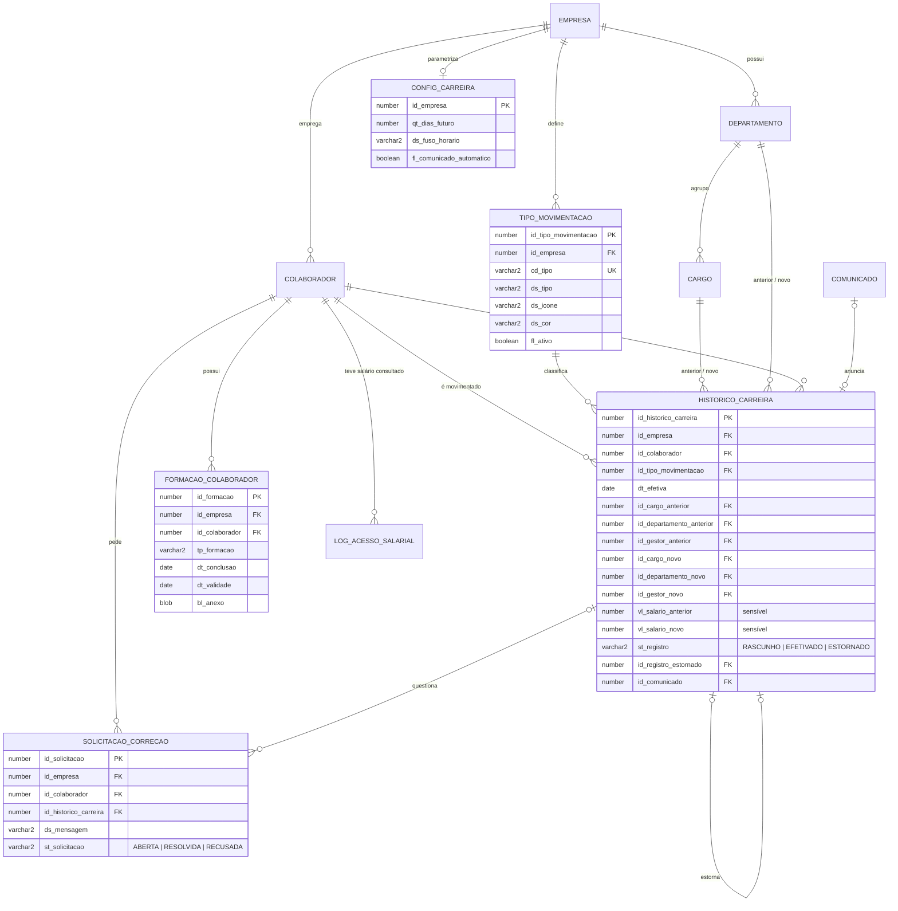
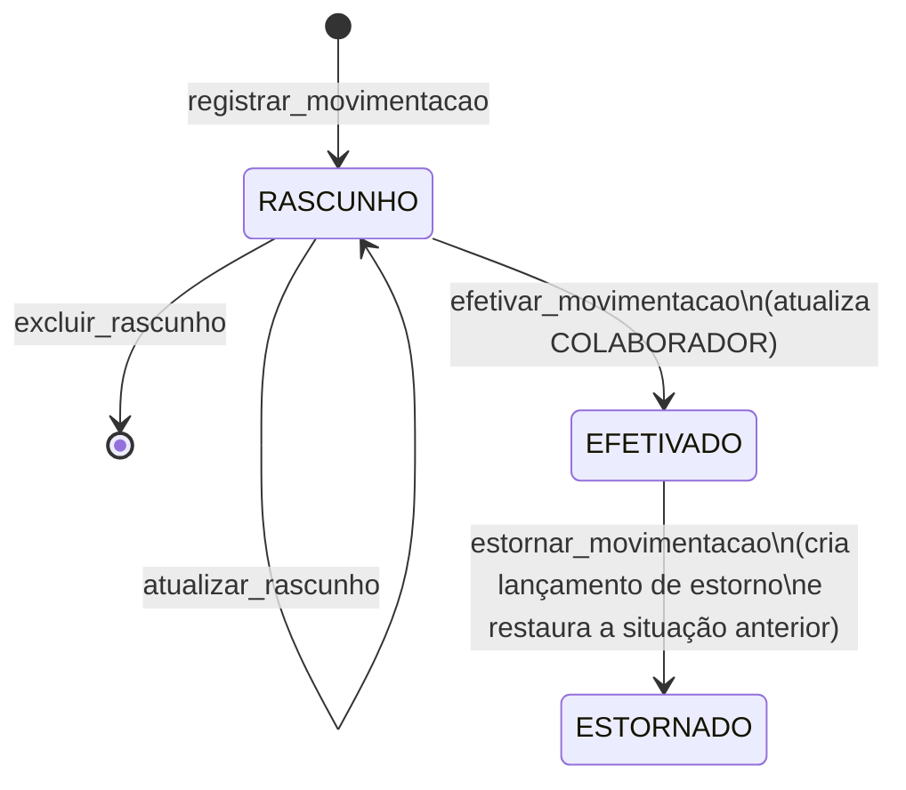

## Módulo: Histórico de Carreira

> Oracle APEX 26.1.5 · Oracle Database 23ai (Autonomous Database)

Registra a trajetória profissional de cada colaborador dentro da empresa (admissão, promoções, mudanças de cargo, transferências, mérito, jornada, afastamentos, desligamento e readmissão), além de formações e certificações. A trajetória aparece em uma linha do tempo, e o histórico funciona como fonte de verdade do RH: depois de efetivado, nenhum lançamento é alterado ou excluído. Correções são feitas por estorno mais um novo lançamento.

Ao efetivar uma movimentação, o cargo, o departamento, o gestor e o status do colaborador são atualizados na tabela `COLABORADOR`, e o organograma passa a refletir a mudança.

### Arquivos (`modulos/historico-carreira/`)

| Arquivo | Conteúdo |
|---|---|
| `instalar.sql` | Roda tudo em ordem no SQLcl e para no primeiro erro |
| `00_verificar_schema.sql` | Confere a versão do banco e as tabelas/colunas reaproveitadas |
| `01_ddl_historico_carreira.sql` | Tabelas, constraints, índices e comentários |
| `02_seed_tipo_movimentacao.sql` | `PRC_SEED_TIPO_MOVIMENTACAO` + tipos padrão para todas as empresas |
| `03_views_carreira.sql` | Views e `FN_CARREIRA_VE_SALARIO` |
| `04_pkg_historico_carreira.pks` / `.pkb` | Package com as regras de negócio |
| `05_triggers_auditoria.sql` | Auditoria e trilha de alterações |
| `06_carga_inicial.sql` | Admissão dos colaboradores que já existem |
| `07_testes.sql` | 2 empresas, 10 colaboradores, um teste por regra e prova de isolamento (termina em rollback) |
| `08_pkg_historico_carreira_ui.sql` | Package que renderiza a página 13 no layout do protótipo |
| `historico-carreira.css` | Estilos da página 13 (tokens do protótipo, responsivo e impressão) |
| `historico-carreira-pagina.js` | Abas, filtro de ano e Exportar PDF da página 13 |
| `historico-carreira.js` | Campos dinâmicos da modal de movimentação (página 18) |
| `Etapas-historico-carreira.md` | Passo a passo das páginas APEX |

### Instalação

```bash
cd modulos/historico-carreira
sql <usuario>@<servico> @instalar.sql
```

Depois, monte as páginas seguindo o `Etapas-historico-carreira.md`.

### Modelo de dados



`LOG_AUDITORIA_CARREIRA` (trilha de todas as operações) ficou fora do diagrama para não poluir: ela referencia só `EMPRESA`.

### Ciclo de vida de um lançamento



### Perfis de acesso

| Perfil | Vê | Altera | Salário |
|---|---|---|---|
| `ADMIN_RH` | Todos da empresa | Tudo, sempre pelo package | Sim, com log de acesso |
| `GESTOR` | A própria equipe, em qualquer nível abaixo | Nada | Não |
| `COLABORADOR` | O próprio histórico | Nada | Não |

### Decisões técnicas

- **Nomes adaptados ao schema real.** As tabelas existentes não têm prefixo (`EMPRESA`, `COLABORADOR`, `DEPARTAMENTO`, `CARGO`), então as novas também não têm. As colunas novas seguem a convenção pedida (`DT_`, `DS_`, `VL_`, `ST_`, `FL_`), mesmo que as tabelas antigas usem outra (`DATA_ADMISSAO`, `NOME`).
- **Oracle 23ai.** O schema já usa colunas `BOOLEAN` (`COLABORADOR.STATUS`), o que só existe no 23ai. Por isso os scripts usam `CREATE ... IF NOT EXISTS` e `MERGE ... USING (VALUES ...)`: são reexecutáveis sem SQL dinâmico. `FL_ATIVO` também é `BOOLEAN`, como no resto do projeto.
- **Snapshot completo na efetivação.** Ao efetivar, o lançamento recebe a situação anterior e a situação resultante completas (cargo, departamento e gestor), mesmo quando não mudaram. Assim, o último lançamento válido sempre descreve a situação atual, e a `VW_SITUACAO_ATUAL_COLABORADOR` é um simples `ROW_NUMBER()`. Foi incluído `ID_GESTOR_ANTERIOR`, que não estava no pedido, porque o estorno precisa dele para devolver o gestor.
- **Estorno.** O original muda de `EFETIVADO` para `ESTORNADO` (única transição aceita em um efetivado) e um novo lançamento `EFETIVADO`, com `ID_REGISTRO_ESTORNADO` apontando para o original, registra a reversão. Só a última movimentação válida pode ser estornada. Assim a cadeia de eventos nunca fica inconsistente, e corrigir algo antigo exige estornar em ordem.
- **Movimentação válida.** Efetivada, não estornada e que não é um estorno. Essa definição fica em uma view só (`VW_MOVIMENTACAO_VALIDA`), usada pelo package, pela situação atual e pelo dashboard.
- **Lançamento retroativo bloqueado.** Uma movimentação não pode ter data anterior à última efetivada. Sem isso, efetivar algo no passado atualizaria o cadastro para uma situação que já foi superada.
- **Readmissão.** É uma `ADMISSAO` lançada depois de um `DESLIGAMENTO`. Reativa `COLABORADOR.STATUS` e atualiza `DATA_ADMISSAO`, então o tempo de casa conta a partir da readmissão. Desligamento grava `STATUS = false`, o que já tira a pessoa do organograma.
- **Tipos personalizados.** Cada empresa pode renomear, recolorir ou desativar tipos e criar códigos novos. Os nove códigos padrão têm comportamento próprio no package; códigos novos são eventos genéricos que não mexem em cargo, departamento nem gestor.
- **"Hoje" no fuso da empresa.** O Autonomous Database roda em UTC, então `SYSDATE` vira o dia seguinte às 21h de Brasília. As datas de negócio usam `PKG_HISTORICO_CARREIRA.FN_HOJE`, com fuso configurável por empresa (`CONFIG_CARREIRA`, padrão `America/Sao_Paulo`). O mesmo vale para o limite de dias no futuro (padrão 30).
- **Multi-tenant.** Optamos pelo item de aplicação `G_ID_EMPRESA`, preenchido no login, em vez de VPD. O VPD exigiria privilégios que o schema de workspace do ADB normalmente não tem (`CREATE ANY CONTEXT`, `EXECUTE ON DBMS_RLS`). Para compensar, o isolamento é aplicado em três camadas: toda query das páginas filtra por `:G_ID_EMPRESA`; o package recusa colaborador, cargo, departamento, gestor ou tipo de outra empresa; e, em sessão APEX, o package confere a empresa do registro contra `G_ID_EMPRESA` (sessão sem empresa é bloqueada). O `07_testes.sql` prova as três. Se no futuro for possível usar VPD, as tabelas novas já têm `ID_EMPRESA` e índices começando por ela.
- **Salário (LGPD).** Proteção em duas camadas: as colunas são escondidas por Server-side Condition `ADMIN_RH`, e a `VW_HISTORICO_CARREIRA` devolve nulo para quem não é `ADMIN_RH` (`FN_CARREIRA_VE_SALARIO`, avaliada uma vez por consulta). A timeline e a situação atual não têm colunas salariais. Cada exibição de salário grava em `LOG_ACESSO_SALARIAL` por transação autônoma.
- **Triggers só de auditoria.** Preenchem as colunas `DT_`/`USR_`, impedem forjar a autoria e gravam `LOG_AUDITORIA_CARREIRA`. Elas também bloqueiam `UPDATE`/`DELETE` direto em lançamento efetivado. Isso é proteção da trilha (vale até para quem acessa o banco fora do APEX), não regra de negócio: as regras continuam no package.
- **Sem commit no package.** O APEX faz o commit ao fim da página. Salvar e efetivar na mesma submissão formam uma transação só: se a efetivação falhar, o rascunho também é desfeito.
- **Admissão automática por processo, não por trigger.** A trigger em `COLABORADOR` misturaria regra de negócio com auditoria. O cadastro (página 14) chama `REGISTRAR_ADMISSAO_AUTOMATICA` logo depois de salvar.
- **Formações com DML nativo.** A grid de formações usa o processamento automático do APEX, porque a imutabilidade vale só para movimentações. O anexo fica numa modal, porque até o APEX 24.2 o Interactive Grid não fazia upload. Na 26.1.5, confira se isso mudou (ver `Etapas-historico-carreira.md`, item 4).

- **Página no layout do protótipo.** A página 13 é uma região Dynamic Content renderizada por `PKG_HISTORICO_CARREIRA_UI`, o mesmo padrão do organograma. O layout (faixa de cargos proporcional ao tempo, antes/depois, abas com contagem) não cabe nos templates prontos do Universal Theme. As abas e o filtro de ano rodam no navegador, sem nova ida ao servidor. "Exportar PDF" usa a impressão do navegador, com CSS próprio para impressão.
- **Comunicado automático.** Admissão, readmissão, promoção e transferência efetivadas publicam um comunicado em `COMUNICADO` para o departamento de destino, na mesma transação da efetivação. Mérito, mudança de gestão, afastamento e desligamento nunca geram comunicado, e o texto nunca menciona salário. Cada empresa pode desligar isso em `CONFIG_CARREIRA.FL_COMUNICADO_AUTOMATICO`. A carga inicial não publica nada.
- **Mudança de gestão e efetivação de contrato.** O protótipo tem esses eventos, então viraram tipos próprios (`MUDANCA_GESTOR`, que exige um gestor novo diferente do atual, e `EFETIVACAO_CONTRATO`, um evento genérico).
- **Solicitar correção.** O colaborador não altera o histórico: ele abre um pedido em `SOLICITACAO_CORRECAO`, e o RH corrige por estorno + novo lançamento e marca o pedido como resolvido (ou recusa, com justificativa).
- **O que cada perfil vê na página.** Reajustes por mérito aparecem só para o próprio colaborador e para o RH. O motivo de afastamentos fica oculto para o gestor, porque pode conter dado de saúde.

### Limitações conhecidas

- **Itens do protótipo sem dado.** PDI, Resultados 360, "Aprovado por" e o regime de contratação ("CLT") não existem no modelo atual (ver `Etapas-historico-carreira.md`, item 2.8).
- **Comunicado sem imagem.** Os comunicados automáticos não têm imagem de capa. Na Home, o card reserva 260px para a capa, então aparece um espaço vazio. Vale definir uma imagem padrão para comunicados sem `IMAGEM`.

- **Remover o gestor.** Uma movimentação não consegue deixar o colaborador sem gestor (gestor vazio significa "manter o atual").
- **Excluir colaborador com histórico.** Fica bloqueado pelas FKs, o que é intencional: o histórico é permanente. Para quem saiu, use `DESLIGAMENTO`.
- **Carga inicial.** Colaboradores inativos antes da instalação ganham só a admissão, sem o desligamento correspondente. Lance o desligamento manualmente se precisar do turnover histórico.
- **Usuário do RH sem cadastro.** Se o usuário não estiver em `COLABORADOR`, ele não tem `G_ID_EMPRESA` e não acessa o módulo. Cadastre-o na empresa.
